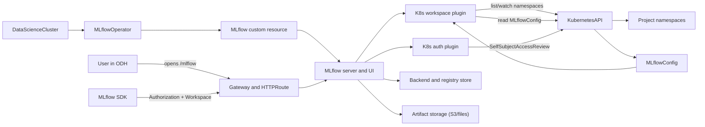

# MLflow Architecture

## Overview

In Open Data Hub (ODH), MLflow is deployed as a single shared tracking service by the MLflow Operator. The runtime architecture in this repository is centered on two Kubernetes-aware MLflow extensions:

- The `kubernetes://` workspace provider maps Kubernetes namespaces to MLflow workspaces.
- The `kubernetes-auth` application plugin enforces Kubernetes RBAC for each MLflow API request.

Together, these extensions let MLflow reuse platform concepts that already exist in ODH:

- A data science project namespace becomes an MLflow workspace.
- Kubernetes RBAC determines what each caller can do in that workspace.
- A single namespace-scoped `MLflowConfig` resource named `mlflow` can override artifact storage at the MLflow workspace level.

## Supported ODH Deployment Path

The supported ODH deployment model is operator-managed:

1. The platform enables the MLflow Operator from the `DataScienceCluster`.
2. The operator reconciles a cluster-scoped `MLflow` custom resource.
3. The operator's Helm chart runs `mlflow server` with workspaces enabled, `kubernetes://` as the workspace store, and `kubernetes-auth` as the active app.
4. Users and SDK clients reach the shared MLflow service through the ODH data science gateway's `/mlflow` endpoint.

## Runtime Diagram

## Key Runtime Components

### MLflow Server

The operator-managed deployment runs `mlflow server` with these architectural characteristics:

- Workspaces are enabled.
- The active application plugin is `kubernetes-auth`.
- The workspace store URI is `kubernetes://`.
- TLS is terminated inside the MLflow pod.
- Telemetry and server-side job execution are disabled by default in the ODH deployment.

MLflow serves both the REST APIs and the UI, so the same runtime handles experiment tracking, model registry traffic, workspace resolution, and artifact routing.

### Kubernetes Workspace Provider

The workspace provider is the core ODH integration point for multitenancy.

It treats Kubernetes namespaces as the source of truth for MLflow workspaces. This keeps workspace lifecycle outside MLflow itself: projects and namespaces are created and managed by the platform, and MLflow reflects them as workspaces instead of provisioning its own workspace objects.

The provider can also honor namespace-scoped `MLflowConfig` resources for per-namespace artifact storage overrides, while the shared deployment still provides the default backend and artifact configuration for the service as a whole.

### Kubernetes Authorization Plugin

The `kubernetes-auth` plugin protects the MLflow server by enforcing Kubernetes RBAC for each request in the active workspace.

In ODH, the deployment uses `self_subject_access_review`, so authorization is based on the caller's own Kubernetes credentials rather than a separate MLflow-specific permission system. The plugin also ensures that users only see workspaces they are allowed to access.

### Embedded UI Behavior

MLflow can be embedded in the ODH dashboard, but the embedded UI still talks to the same shared MLflow backend exposed under `/mlflow`. The embedding layer carries workspace context into frontend API calls while keeping navigation inside the dashboard shell.

## Request Flows

MLflow is reached through two main access paths:

- Users access the shared service through the ODH gateway at `/mlflow`, with the operator-managed `HTTPRoute` forwarding UI and API traffic to MLflow.
- SDK clients send requests to the same shared service with an `Authorization` header and workspace context, and the `kubernetes-auth` plugin enforces RBAC before MLflow handles the request.

### Artifact Resolution

Artifact configuration has two layers:

- The shared `MLflow` custom resource defines the default backend, registry, and artifact storage for the deployment, including whether MLflow serves artifacts itself or clients access the storage backend directly.
- An optional namespace-scoped `MLflowConfig` can override artifact storage for a specific workspace.

This keeps storage centralized by default while still allowing namespace-level overrides when needed. When artifact serving is enabled, clients read and write artifacts through the MLflow server. When it is disabled, clients interact directly with the configured artifact store.

## Important Boundaries

- MLflow does not own project or namespace lifecycle in ODH.
- Workspaces are read-only reflections of namespaces, not independent MLflow-managed objects.
- Authorization is based on Kubernetes pseudo-resources in `mlflow.kubeflow.org`, not on real namespaced MLflow CR instances.
- One shared MLflow deployment can serve many namespaces because workspace isolation is enforced through request context, RBAC, and artifact-root resolution rather than per-namespace MLflow servers.
